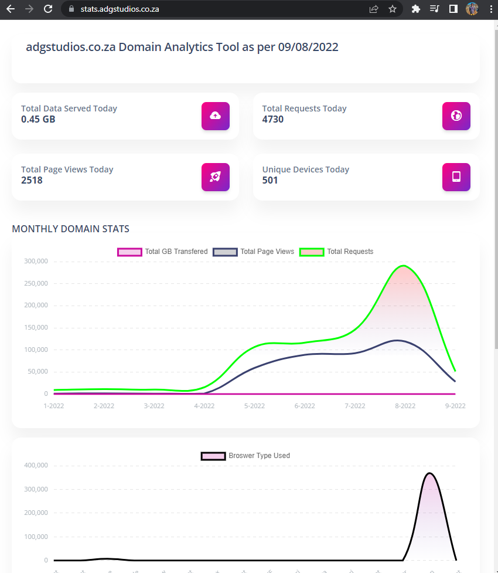

# Cloudflare Analytics Dashboard Tool

This is a tool to help you get started with Cloudflare Analytics. It uses the GraphQL API to fetch data from Cloudflare and display it in a dashboard. You may use this tool to get started with Cloudflare Analytics, or as a reference for how to use the GraphQL API.

## Getting Started

In `app.py` set the following variables:

```
domainname = 'mydomain'
```

In `gqlcloudflare.py` set the following variables:

```
#FULL IN YOUR CLOUDFLARE DETAILS HERE
gqlapikey = 'APIKEY'
email = 'EMAIL'
zonetag = 'ZONEID'
```

Once done, run the following command to install the required packages:

```
pip install -r requirements.txt
```

Then run the following command to start the dashboard:

```
python app.py
```

## Deployment to Web

This tool is deployed using Heroku. You can deploy it using Heroku by clicking the button below:

[](https://heroku.com/deploy)

Click the button above, and then fill in the required details.

Set the app type to `Container Type` using the Heroku CLI:

Then `Deploy App`.

Once the app is deployed, click the `Manage App` button. Then click the `Open App` button to open the app.


## Screenshots


### Made with ❤️ by [ADGSTUDIOS](https://adgstudios.co.za)

